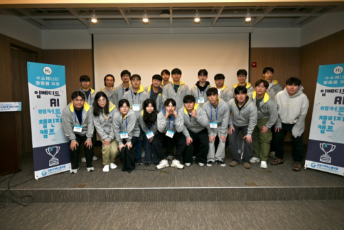

# 라즈베리파이를 활용한 수소량 계측 및 경보 시스템 앱 개발 

> 라즈베리파이로 수소량 데이터를 수집하고 이를 flutter 앱 화면에 온도, 습도 데이터와 나타낸다.
> 관련 진행 사항 블로그: [제 1회 수소에너지 활용을 위한 임베디드 AI 해커톤 챌린지 캠프](https://blog-of-tifo.tistory.com/2)

## 결과

    

> 제 1회 수소에너지 활용을 위한 임베디드 AI 해커톤 챌린지 캠프 (2024 02월 개최) 장려상 수상
> 관련 기사 url: [국립강릉원주대 스마트수소에너지사업단 '임베디드 AI해커톤 챌린지 캠프' 성료](https://www.veritas-a.com/news/articleView.html?idxno=495254)

---

## 목차
[1. 소개](#1-소개)
[2. 역할 분배](#2-역할분배)
[3. 주요 기능](#3-주요-기능)
[4. 시스템 아키텍쳐](#4-시스템-아키텍쳐)
[5. 사용 툴 & 언어](#5-사용-언어-&-툴)
[6. 플로우 차트](#6-플로우차트)
[7. 앱화면](#7-앱화면)

---

## 소개 
> 수소 감지 시스템이 설비되어 있지 않거나, 설비되어 있더라도 정상 작동하지 않아 안전사고가 발생하는 사례가 생겨나고 있습니다. 이러한 불안감을 덜고자 라즈베리 파이를 활용하여 여러 장소에서 사용이 가능한 수소량 계측 및 경보 시스템 앱 개발을 하고자 합니다. 대기 중의 수소량, 일정 수소량과 같은 정보를 핸드폰 애플리케이션을 통하여 한눈에 알아볼 수 있게 만들고 수소가 일정량 이상 공기 중에 누출되었을 경우(폭발, 화재 등의 위험 단계) 경보를 울려주는 시스템을 구축하는 것을 프로젝트 최종 목표로 삼았습니다.

 

---

## 역할 분배
|팀원|역할|
|---|:---:|
|구용우|팀장, 하드웨어 설계, 발표|
|유동현|하드웨어 설계, 통신 프로그래밍 (python)|
|김유정|코딩 총괄, 프론트엔드 (flutter), 백엔드 (python)|
|이현주| UI, 디자인 |

 

---

## 주요 기능
> 1. 수소 인식: 가스 감지 센서가 대기 중의 수소를 감지함.
> 2. 수치 표시 : 핸드폰 애플리케이션을 통하여 대기 중에 있는 수소의 양이 얼마나 있는지 수치를 숫자로 한눈에 알아보게 쉽게 표시해 줌. 
> 3. 수소 누출 감지: 일정량 이상 수소가 누출되면 감지하여 핸드폰 앱에 알림을 보냄.

    

 

---

## 시스템 아키텍쳐

    

 

---

## 사용 언어 & 툴

### 프론트엔드

> Flutter (dart) : 애플리케이션 구성

 

### 백엔드

> Python: Rasberry pi에서 firebase로 수소량 데이터 전송

 

### 데이터베이스

> firebase: 수소량 데이터 수집

 

---

## 플로우차트

    

> 설계 단계 플로우 차트

 

---

## 앱 화면

### 홈화면

    

> 강원도에 있는 수소차 충전소를 나타냈다. 
> 수소차 충전소가 있는 춘천시, 양양군, 강릉시, 원주시가 빨간색 버튼으로 있다. 
> 원하는 지역의 버튼을 누르면 해당 지역에 있는 수소차 충전소 화면으로 이동한다.

 

### 춘천시 항목 화면

    

> 수소량 데이터가 realtime으로 그래프를 통해 가시화 된다.
> 안전한지 여부를 상단 문구와 이모티콘을 통해 알려준다.

 

### 사이드바

    

> 사이드바에서는 숫자 데이터로 나타낸 수소량, 해당 지역의 온도, 습도, 날씨를 알려준다.

---
